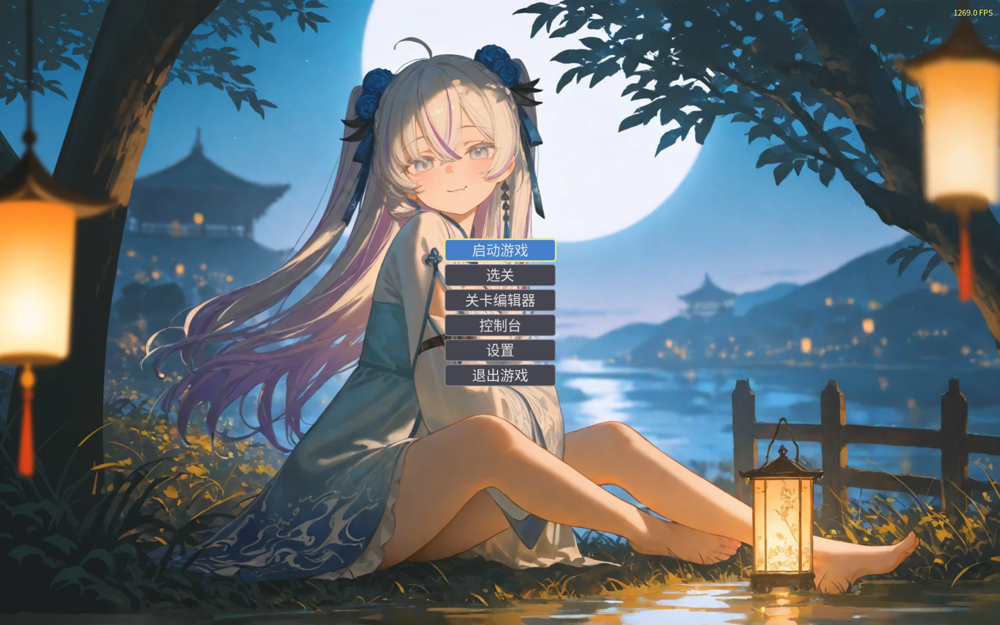
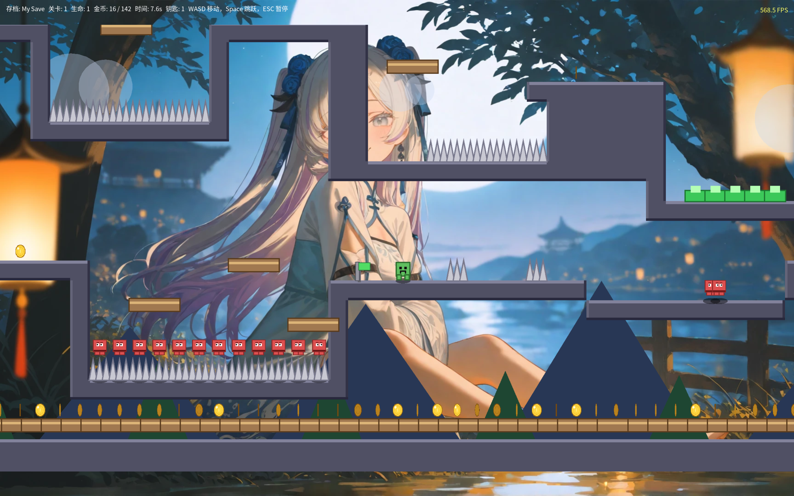
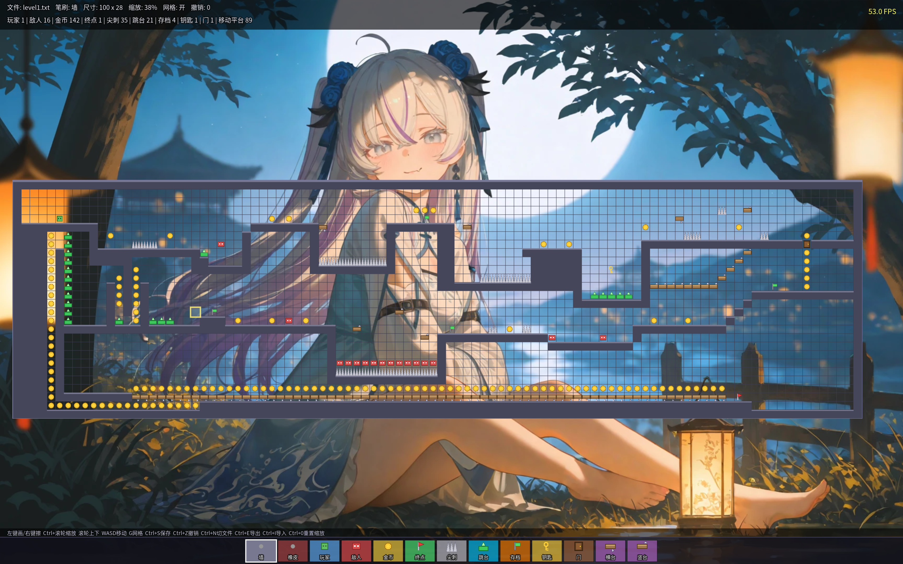
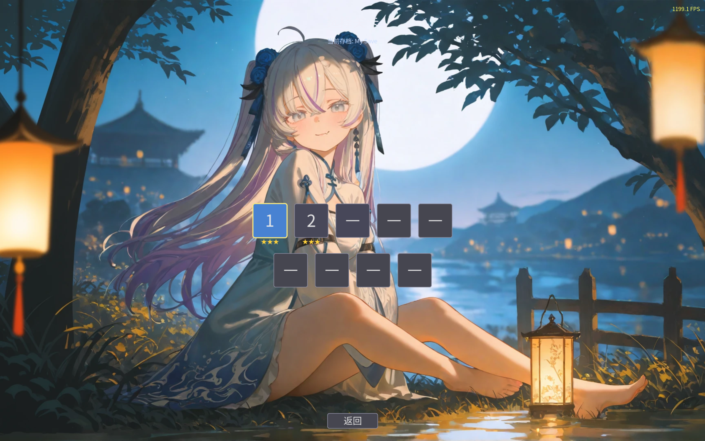

# TEXT-GAME 该文本为AI生成 目前进入维护阶段

[](https://github.com/ljm-233/TEXT-GAME/actions/workflows/build.yml)
[](LICENSE)

一个用 C++20 和 SFML 3 **从零构建**的 2D 平台跳跃游戏。

不依赖任何游戏引擎，从物理系统到 UI 组件全部手写。包含完整的引擎层（依赖注入、事件总线、场景栈、配置系统、日志、UI 组件、动画、通知、音效、多语言、渲染管线）和游戏本体（自写 AABB 物理、ASCII 关卡、玩家控制、敌人、金币、移动平台、弹跳板、存档点、关卡编辑器、关卡验证器、可达性可视化）。

## 🚧 当前状态

> 最后更新：2026-09

| 模块 | 状态 | 说明 |
| :--- | :--- | :--- |
| 引擎层 | ✅ 完成 | DI 容器 / 事件总线 / 场景栈 / 配置 / 日志 / UI 组件 / 动画 / 通知 / 音效 |
| 场景流程 | ✅ 完成 | 主菜单 → 存档选择 → 选关 → 游戏 → 结算；支持场景栈返回（保留状态） |
| 玩家控制 | ✅ 完成 | 土狼时间 / 跳跃缓冲 / 长按跳更高 / 手柄支持 / 键位重映射 |
| 物理系统 | ✅ 完成 | AABB 瓦片扫描 / 固定时间步长 / 单一激活存档点 |
| 摄像机 | ✅ 完成 | 前瞻 / 死区 / 屏幕震动 / 受击停顿 |
| 存档系统 | ✅ 完成 | 创建 / 删除 / 星级 / 进度 / **每关最佳时间（PB）** |
| 设置系统 | ✅ 完成 | 6 个 Tab / 70+ 项，含初始生命（1/3/5/10/99） |
| 控制台 | ✅ 完成 | streambuf 重定向 / 命令系统 / 计算器 |
| 关卡编辑器 | ✅ 完成 | 拖拽绘制 / Shift 矩形 / 撤销 / 缩放 / 分享码 / **可达性可视化** |
| 关卡验证 | ✅ 完成 | BFS 可达性分析 / 命令行工具 / 编辑器内可视化 |
| 渲染管线 | ✅ 完成 | 渲染缩放 / 超采样 / 双三次 / FSR1 上采样 |
| 后处理 | ✅ 完成 | 色彩分级 / 暗角 / 泛光 / 色差 / 颗粒 / 扫描线 / 抖动 / 5 套预设 |
| 软阴影 | ✅ 完成 | 径向渐变纹理，替代原硬边圆盘 |
| 调试工具 | ✅ 完成 | F1~F10 快捷键 / 性能面板 / 截图 / 慢动作 / 碰撞盒 |
| 多语言 | ✅ 完成 | 中文 / 繁體中文 / English / 日本語 / 한국어 |
| 桌面集成 | ✅ 完成 | Linux AppImage / Windows NSIS 安装包 / 自定义图标 |
| 手柄振动 | ⚠️ **接口保留** | SFML 3 已移除振动 API，接口和设置项保留待后续接入 |
| **关卡内容** | ⚠️ **进行中** | 5 个第一版关卡，1~4 关存在可达性问题，待重做 |
| **测试覆盖** | ⚠️ **部分** | 62 个单元测试用例，纯逻辑覆盖较好，游戏对象部分覆盖 |
| 开发工具 | ✅ 完成 | Sanitizer / clang-tidy / CMake Presets / 覆盖率 / 关卡验证器 / 硬编码检测 |

### 已知问题

- 部分 UI 控件（SettingsScene / EditorScene）的回归测试靠手动
- Wayland 下窗口图标无法通过 SFML API 设置（协议限制）
- 手柄振动因 SFML 3 API 缺失未实现

### 短期路线

1. 依次重做 `level2~5`
2. 手柄振动（等 SFML 更新或接入原生 API）

## 📸 截图

<!-- 截图完成后替换为实际图片 -->
| | |
|:---:|:---:|
|  |  |
| 主菜单 | 游戏中 |
|  |  |
| 关卡编辑器 | 关卡完成 |

## 🎮 游戏玩法

### 操作

| 键盘 | 手柄 | 功能 |
| :--- | :--- | :--- |
| **A / ←** | 左摇杆 / 十字键左 | 向左移动 |
| **D / →** | 左摇杆 / 十字键右 | 向右移动 |
| **Space / W / ↑** | A 键 / 十字键上 | 跳跃（长按跳更高） |
| **R** | — | 重生（回到最近的存档点） |
| **ESC** | B 键 | 暂停 / 返回 |
| **Enter** | Start 键 | 确认 / 下一关 |

> 以上键位可在 **设置 → 按键** 中自定义。

### 平台跳跃特性

- **土狼时间**：走出平台边缘 0.1 秒内还能跳
- **跳跃缓冲**：落地前 0.12 秒按跳，落地瞬间自动起跳
- **长按跳更高**：松手立刻给上升速度减半
- **固定时间步长物理**：1/120 秒为单位更新，任何 FPS 下手感一致
- **摄像机前瞻**：跑动时镜头朝移动方向偏移，提前露出前方
- **摄像机死区**：小幅移动时镜头不动，减少眩晕
- **受击停顿**：踩敌 / 受伤时，游戏时间冻结几十毫秒

### 生命与存档

- **初始生命**：在 **设置 → 画面 → 初始生命** 中选择 `1 / 3 / 5 / 10 / 99`
- **存档点**：一个关卡内**最多只有一个激活的存档点**。激活新的会自动取消旧的
- **重生规则**：
  - 掉图 / 被敌人撞 / 踩尖刺后，若还有生命 → 从**最近的存档点**重生
  - 生命耗尽 → **延迟 0.5 秒后**从最近的存档点重生，生命重置
  - 按 `R` 键 → 完全重置关卡（回到出生点、金币归零、存档点取消）
- **没有 Game Over 界面**：生命耗尽后自动重生，不打断游戏流程

### 速通计时（PB）

- 每次通关记录用时
- 关卡完成界面显示：本次用时 / 目标时间 / **历史最佳时间**
- 刷新 PB 时显示金色 `★ 新纪录！`
- 关卡选择页显示每关的 PB

### 游戏元素

| 字符 | 元素 | 说明 |
| :--- | :--- | :--- |
| `#` | 地面 / 平台 | 实体瓦片 |
| `P` | 玩家出生点 | 蓝色脉动圆环标记 |
| `E` | 敌人 | 左右巡逻，会掉头 |
| `C` | 金币 | 上下浮动，收集计数 |
| `J` | 弹跳板 | 碰到就弹飞，有冷却 |
| `S` | 存档点 | 激活后掉图回到这里（单一激活） |
| `M` | 水平移动平台 | 玩家站上去会被带着走 |
| `V` | 垂直移动平台 | 上下移动 |
| `K` | 钥匙 | 收集后解锁所有门 `L` |
| `L` | 门 | 关着时是实体，解锁后消失 |
| `^` | 尖刺 | 碰到受伤 |
| `G` | 终点 | 红色旗帜，到达通关 |

### 关卡元数据

关卡文件顶部可选加元数据（不占瓦片）：

```
# name: 关卡名
# author: 作者名
########################################
#  ...
```

### 调试快捷键

游戏内按下列快捷键，无需退出即可调试：

| 键 | 功能 |
| :--- | :--- |
| **F1** | 调试 HUD（关卡信息 / 玩家坐标速度 / 鼠标 tile） |
| **F2** | 无敌开关（重生后保留） |
| **F3** | 清空所有敌人 |
| **F4** | 重载当前关卡文件（配合编辑器使用） |
| **F5** | 上一关 |
| **F6** | 下一关 |
| **F7** | 慢动作 1x / 0.5x / 0.25x / 0.1x 循环 |
| **F8** | 显示所有碰撞盒 |
| **F9** | 截图到 `./screenshots/` |
| **F10** | 性能面板（帧时间 / update / render / 上采样耗时） |

## 🎨 画面系统

### 渲染管线

```
Scene 绘制 ──> RenderTexture (rt_)
                    │
                    ├─ renderScale < 1.0 ──> [Upscaler: 双三次/FSR1]
                    │
                    ├─ renderScale > 1.0 ──> [超采样降采样]
                    │
                    └─ [PostProcessor: 色彩分级 + 泛光 + 色差 + ...]
                                    │
                                    v
                              window.display()
```

### 超分辨率

`设置 → 界面 → 超分辨率` 三档：

| 模式 | 说明 |
| :--- | :--- |
| **关** | 双线性上采样（最省性能） |
| **双三次** | Catmull-Rom + 轻度锐化 |
| **FSR1** | Lanczos2 EASU（边缘自适应上采样） |

配合 `渲染缩放`（`10%` ~ `200%`）使用：

- **< 100%**：低分辨率渲染 + 超分上采样 → 性能提升
- **= 100%**：直接渲染到窗口
- **> 100%**：超采样渲染 + 降采样 → 抗锯齿

### 后处理

`设置 → 画面` 下方，共 11 个可调项，每项都有滑条、数字输入框、单独重置按钮：

| 效果 | 说明 |
| :--- | :--- |
| **饱和度** | 0% = 灰度，100% = 原色，200% = 过饱和 |
| **对比度** | 50% ~ 200% |
| **亮度** | 50% ~ 200% |
| **伽马** | 50% ~ 250% |
| **暗角** | 屏幕边缘压暗 |
| **泛光强度** | 高亮区域外扩（金币 / 终点 / 跳台） |
| **泛光阈值** | 越低越多物体发光 |
| **色差** | R/B 通道径向偏移（CRT 感） |
| **胶片颗粒** | 每帧微动的随机噪声 |
| **扫描线** | 每隔一行变暗（CRT 感） |
| **抖动** | 4×4 Bayer 矩阵，8-bit 复古质感 |

### 画面预设

`设置 → 画面 → 预设` 一键切换：

| 预设 | 效果 |
| :--- | :--- |
| **原版** | 全部归默认（干净） |
| **复古 CRT** | 色差 + 扫描线 + 暗角 + 颗粒 |
| **电影感** | 泛光 + 暗角 + 高对比 + 轻色差 |
| **像素 8-bit** | 抖动 + 扫描线 + 低强度泛光 |
| **夜晚** | 压暗 + 泛光 + 色差（配合深色主题） |

预设只影响后处理参数，不改动其他画面设置。点预设后可继续手动微调。

## 🗺 关卡设计规范

### 玩家能力上限

基于 `game_constants.h` 中的物理常量（重力 2200、跳跃初速 -720、移动速度 300、瓦片 32px），玩家在标准状态下的能力上限：

| 能力 | 数值 | 说明 |
| :--- | :--- | :--- |
| 向上跳跃 | **≤ 3.5 格** | 理论 3.68 格，留 0.18 格容错 |
| 水平跨距 | **≤ 5.5 格** | 理论 6.1 格，留 0.6 格容错 |
| 土狼时间加成 | +0.9 格水平 | 走出边缘后 0.1 秒内仍可跳 |
| 跳跃缓冲加成 | +0.9 格水平 | 落地前 0.12 秒按跳仍生效 |
| 弹跳板 `J` | **≤ 10 格高** | 突破普通跳跃限制，`kLaunchSpeed = -1200` |

### 画关卡时的检查清单

- [ ] 出生点周围 3 格内是平地（玩家不会一出生就掉图）
- [ ] 相邻平台垂直差 ≤ 3 格（保守值）
- [ ] 相邻平台水平差 ≤ 5 格（保守值）
- [ ] 需要跨越的坑宽度 ≤ 5 格
- [ ] 尖刺 `^` 前有至少 3 格反应距离
- [ ] 终点 `G` 站在实体瓦片上（不是悬空）
- [ ] 钥匙 `K` 和门 `L` 之间有绕路，不是直线
- [ ] 存档点 `S` 放在关卡中段，且玩家会自然路过

### 在编辑器里验证

编辑器内按 **T** 打开可达性可视化：

| 颜色 | 含义 |
| :--- | :--- |
| 🟢 淡绿 | 从出生点可达的平台顶面 |
| 🔴 淡红 | 不可达的平台顶面 |
| 🟩 亮绿 | 可达的金币 / 敌人 / 钥匙 / 门 / 存档 / 跳台 / 终点 |
| 🟥 亮红 | 不可达的 spawn |
| 🟦 蓝色 | 玩家出生点 |

一眼就能看出哪块跳不上、哪个金币收不到，不用切场景试玩。

### 命令行验证

```bash
./build/debug/validate_levels assets/levels
```

输出示例：

```
[ OK ] level1.txt: OK (5/5 platforms reachable)
[FAIL] level3.txt: FAIL | goal unreachable | platforms 2/8 reachable
  3 unreachable items:
    - coin @ (42,6)
    - enemy @ (55,8)
    - goal @ (98,4)

Total: 5 levels, 1 failed, 0 unloadable
```

## 📁 项目结构

```text
TEXT-GAME/
├── assets/
│   ├── font.otf              # 字体（需自己提取，见下文）
│   ├── lang/                 # 翻译文件
│   │   ├── en.txt
│   │   ├── ja.txt
│   │   ├── ko.txt
│   │   └── zh-TW.txt
│   ├── levels/               # ASCII 关卡文件
│   │   ├── level1.txt ~ level5.txt
│   │   └── editor.txt
│   └── shaders/              # GLSL 着色器
│       ├── upscale.frag      # 双三次上采样
│       ├── fsr1.frag         # FSR1 EASU
│       ├── postprocess.frag  # 后处理合成
│       ├── brightpass.frag   # 泛光：亮部提取
│       └── blur.frag         # 泛光：高斯模糊
├── include/
│   ├── config/               # 配置类（Bootstrap / Runtime / Preferences）
│   ├── core/                 # 核心（Application、Game、SceneManager、Logger、Lang、text_strings）
│   ├── game/                 # 游戏本体
│   │   ├── vec2.h            # 二维向量
│   │   ├── aabb.h            # 碰撞盒
│   │   ├── game_constants.h  # 物理常量
│   │   ├── game_object.h     # 对象基类
│   │   ├── event_bus.h       # 事件总线
│   │   ├── level.h           # ASCII 关卡
│   │   ├── level_validator.h # 关卡可达性验证
│   │   ├── level_codec.h     # 关卡编码（分享码）
│   │   ├── camera.h          # 摄像机
│   │   ├── player.h          # 玩家
│   │   ├── enemy.h           # 敌人
│   │   ├── coin.h            # 金币
│   │   ├── jump_pad.h        # 弹跳板
│   │   ├── checkpoint.h      # 存档点
│   │   ├── moving_platform.h # 移动平台
│   │   ├── key.h / door.h    # 钥匙 / 门
│   │   ├── spike.h           # 尖刺
│   │   ├── parallax.h        # 视差背景
│   │   ├── level_intro.h     # 关卡开场文字
│   │   └── game_world.h      # 游戏世界
│   ├── scene/                # 7 个场景
│   └── ui/                   # UI 组件
│       ├── button.h
│       ├── slider.h          # 滑条（带数字输入 + 重置按钮）
│       ├── text_input.h
│       ├── window.h          # 窗口 + 渲染缩放管线
│       ├── upscaler.h        # 超分控制器
│       ├── postprocess.h     # 后处理控制器
│       ├── console.h
│       ├── sound_manager.h
│       ├── gamepad.h         # 手柄（振动接口保留）
│       └── ...
├── packaging/
│   ├── icons/                # 图标生成脚本 + 生成结果
│   │   └── generate_icons.py
│   ├── linux/                # Linux 打包
│   │   ├── AppRun
│   │   └── text-game.desktop
│   ├── windows/              # Windows 打包
│   │   └── text-game.rc
│   └── build_appimage.sh     # Linux AppImage 打包脚本
├── scripts/
│   ├── check_hardcoded.py    # 中文硬编码检测
│   ├── test.sh               # 一键跑单元测试
│   └── gen_levels.py         # 关卡生成器
├── src/                      # 对应 include 的实现
├── tests/                    # 单元测试（doctest，62 个用例）
├── tools/
│   └── validate_levels.cpp   # 关卡验证器（命令行）
├── wallpaper/                # 壁纸资源
├── .clang-format
├── .clang-tidy               # 静态分析配置
├── .editorconfig
├── .gitignore
├── CMakeLists.txt
├── CMakePresets.json         # 构建预设
├── LICENSE
├── README.md
└── CLAUDE.md                 # 给 AI 助手的项目说明
```

## 🧩 核心架构

### 引擎层

| 模块 | 职责 |
| :--- | :--- |
| **DI 容器** | 统一注册/解析所有依赖，自动缓存单例 |
| **事件总线** | GameWorld 发出游戏事件（跳跃/落地/金币/踩敌/受伤/...），GameScene 订阅处理音效/粒子/振动。解耦 `game` 层与 `ui` 层 |
| **场景系统** | 主菜单 / 存档选择 / 选关 / 游戏 / 设置 / 控制台 / 编辑器；支持场景栈返回（保留场景状态）；生命周期钩子 `onEnter/onExit/onPause/onResume` |
| **配置分层** | Bootstrap / Runtime / Preferences，延迟落盘 |
| **日志** | 彩色终端 + 文件 + 多级别 + 轮转 + 保留份数 |
| **多语言** | 用中文原文作 key，运行时查表；支持中/繁中/英/日/韩 |
| **虚拟终端** | 用 `streambuf` 重定向 `cin`/`cout`，支持命令系统 |
| **UI 组件** | Button / Slider / TextInput / ConfirmDialog / PauseMenu |
| **Slider 增强** | 内置数字输入框（回车确认）+ 单滑块重置按钮 |
| **主题** | 深色 / 蓝色 / 浅色，所有组件自动跟随 |
| **动画** | 颜色平滑过渡，指数逼近，支持开关和速度 |
| **通知** | 屏幕角落消息，4 类型 × 4 位置 |
| **音效** | 程序化生成（正弦扫频 + 琶音 + 敲击），零外部依赖 |
| **手柄** | 焦点导航（方向键切按钮，A 键触发）；振动接口保留 |
| **键位** | 运行时重映射（设置 → 按键） |
| **粒子** | 跳跃 / 落地 / 金币 / 踩敌人 / 受伤 |
| **打包** | CPack / AppImage / NSIS 一键生成 |

### 渲染管线

| 模块 | 职责 |
| :--- | :--- |
| **Window** | 窗口管理 + 渲染目标切换（window / RenderTexture） |
| **渲染缩放** | 10% ~ 200%，自动选择直通 / 中间 RT |
| **Upscaler** | 双三次 / FSR1 EASU，只在上采样时启用 |
| **PostProcessor** | 色彩分级 + 暗角 + 泛光 + 色差 + 颗粒 + 扫描线 + 抖动 |
| **Bloom** | 1/4 分辨率三 pass：brightpass → blurH → blurV |
| **软阴影** | 径向渐变纹理 + 二次衰减 |
| **性能计时** | endFrame 内部打点，暴露给调试面板 |

### 游戏层

| 模块 | 说明 |
| :--- | :--- |
| **物理** | 自写 AABB 瓦片扫描，先水平后垂直 |
| **关卡** | ASCII 加载 + 视锥裁剪 + 顶点批处理 |
| **关卡验证** | BFS 从出生点出发，报告孤立平台 / 不可达元素 |
| **可达性可视化** | 编辑器按 T 显示每格可达状态 |
| **关卡分享码** | RLE + Base64，把 ASCII 关卡压缩成可分享字符串 |
| **伪 3D** | 瓦片顶面高光 + 侧面阴影 + 对象投影 + 软阴影 |
| **玩家** | 苦力怕精灵动画 + 弹性变形 + 无敌闪烁 + 受击闪白 |
| **摄像机** | 前瞻 + 死区 + 屏幕震动 + 受击停顿 |
| **存档点** | 单一激活，新激活自动取消旧激活 |
| **调试工具** | F1~F10 快捷键 + 性能面板 + 截图 + 慢动作 + 碰撞盒 |

## 🛠 技术栈

- **语言**：C++20
- **构建**：CMake ≥ 3.23 + Ninja + CMake Presets
- **图形/音频**：SFML 3
- **OpenGL**：用于截图（`glReadPixels`）
- **依赖注入**：自研简易 `Container`
- **物理**：自写 AABB（不依赖 Box2D）
- **着色器**：GLSL 330 core（超分 + 后处理）
- **测试**：doctest（单头文件，62 个用例）
- **静态分析**：clang-tidy
- **内存检测**：AddressSanitizer + UndefinedBehaviorSanitizer
- **覆盖率**：gcov + lcov
- **打包**：CPack / AppImage / NSIS
- **CI**：GitHub Actions（Arch / Ubuntu / macOS / Windows / 关卡验证）
- **跨平台**：Linux / Windows / macOS

## 🚀 构建与运行

### 环境要求

**Arch Linux**：
```bash
sudo pacman -S base-devel cmake ninja sfml python-fonttools python-pillow lcov clang mesa
```

**Ubuntu / Debian**：
```bash
sudo apt install build-essential cmake ninja-build libsfml-dev lcov clang-tidy libgl1-mesa-dev
```
> ⚠️ Ubuntu 24.04 的 `libsfml-dev` 可能是 SFML 2.6。需要从源码编译 SFML 3，见 CI 配置。

**macOS**：
```bash
brew install cmake ninja sfml lcov
```

**Windows**：Visual Studio 2022 + vcpkg
```powershell
vcpkg install sfml:x64-windows
```

### 准备字体

项目需要中文字体文件 `assets/font.otf`：

```bash
python3 -c "
from fontTools.ttLib import TTCollection
ttc = TTCollection('/usr/share/fonts/noto-cjk/NotoSansCJK-Regular.ttc')
ttc.fonts[2].save('assets/font.otf')
"
```

或者从 [Google Fonts](https://fonts.google.com/noto/specimen/Noto+Sans+SC) 下载 `NotoSansSC-Regular.otf` 重命名为 `font.otf`。

### 编译运行（推荐用 Preset）

```bash
git clone git@github.com:ljm-233/TEXT-GAME.git
cd TEXT-GAME

cmake --list-presets

# Debug 构建
cmake --preset debug
cmake --build --preset debug
./build/debug/text_game

# Release 构建（**推荐跑游戏用这个**）
cmake --preset release
cmake --build --preset release
./build/release/text_game
```

**可用的 Preset**：

| Preset | 用途 |
| :--- | :--- |
| `debug` | 标准 Debug 构建 |
| `release` | 发布构建 |
| `tests` | Debug + 单元测试 |
| `asan` | Debug + 测试 + Sanitizer |
| `coverage` | Debug + 测试 + 覆盖率 |
| `clang-tidy` | Debug + 静态分析 |
| `release-package` | 用于 cpack 的发布构建 |

> ⚠️ Debug 构建下 SFML 的 `sf::Text` 和 `sf::Shape` 构造极慢，编辑器帧率可能只有 20~30fps。**跑游戏和编辑器请用 Release**。

### 打包发布

**Linux AppImage**：

```bash
python3 packaging/icons/generate_icons.py
cmake --preset release-package
cmake --build --preset release-package -j
./packaging/build_appimage.sh
./build/TEXT-GAME-0.1.0-x86_64.AppImage
```

**Windows NSIS 安装包**：

```powershell
cmake --preset release
cmake --build --preset release -j
cd build/release
cpack -G NSIS
```

**通用 CPack**：

```bash
cmake --preset release-package
cmake --build --preset release-package
cd build/release-package
cpack
```

### 单元测试

```bash
cmake --preset tests
cmake --build --preset tests
ctest --preset tests
```

### 内存检测

```bash
cmake --preset asan
cmake --build --preset asan
./build/asan/tests/unit_tests
./build/asan/text_game
```

### 代码覆盖率

```bash
cmake --preset coverage
cmake --build --preset coverage
cmake --build build/coverage --target coverage
# 报告生成在 build/coverage/coverage_html/index.html
```

### 静态分析

```bash
cmake --preset clang-tidy
cmake --build --preset clang-tidy -j
```

### 关卡验证

```bash
./build/debug/validate_levels assets/levels
```

### 检查硬编码中文

```bash
python3 scripts/check_hardcoded.py
```

## 🎛 功能一览

### 主菜单

- **启动游戏**：选择 / 创建 / 删除存档
- **选关**：直接跳到已解锁的关卡，显示星级和 PB
- **关卡编辑器**：可视化编辑 ASCII 关卡
- **控制台**：内嵌虚拟终端，支持命令和计算器
- **设置**：6 个 Tab，70+ 项
- **退出游戏**

### 设置

**显示**：分辨率 / 全屏 / 垂直同步 / 抗锯齿 / 日志级别 / 帧率上限

**界面**：FPS 显示 / 界面缩放 / 字体缩放 / 渲染缩放 / **超分辨率** / 主题 / 语言 / 壁纸 / 时钟 / 控制台遮罩 / 字号 / 历史 / 行高 / 自动滚动 / 光标闪烁 / 提示符

**画面**：初始生命 / 动画 / 伪3D / 视差 / 玩家动画 / 关卡开场 / 粒子 / 屏幕震动 / 通知 / 按钮圆角 / 按钮边框 / 显示碰撞盒 / **画面预设** / **11 项后处理**

**音频**：总音量 / 音效开关 / 音效音量 / BGM 开关 / BGM 音量 / 手柄支持 / **手柄振动** / **振动强度**

**按键**：左移 / 右移 / 跳跃 / 暂停 / 重开（可重映射）

**其他**：记住窗口大小 / 失焦自动暂停 / 日志轮转 / 保留份数 / 玩家名 / 关于 / 恢复默认

> **所有可拖动的滑块**都带数字输入框（回车确认）+ 单滑块重置按钮（↺）。画面 Tab 底部还有一个"重置画面"按钮，一键归零所有后处理。

### 关卡编辑器

- 底部笔刷面板（13 种元素，图标预览）
- **左键画 / 拖动连画**（斜线也支持）
- **Shift + 拖动 = 矩形填充**（带黄色预览）
- **右键擦 / 拖动连擦**
- **T 键**：可达性可视化开关
- `Ctrl+Z` 撤销（100 步栈）
- `Ctrl+S` 保存
- `Ctrl+N` 切换文件
- `Ctrl+E` 导出分享码
- `Ctrl+I` 导入分享码
- `Ctrl+0` 重置缩放
- `Ctrl+滚轮` 缩放（以鼠标为中心）
- `WASD` / 方向键移动摄像机
- `[` `]` `-` `=` 调整关卡尺寸
- `G` 开关网格
- 顶部 HUD：文件名 / 笔刷 / 尺寸 / 缩放 / 网格 / 撤销栈深度 / 可达性状态
- 第二行：元素统计（玩家 / 敌人 / 金币 / ...）
- **性能优化**：笔刷条和关卡图标预渲染到 `RenderTexture`，静止时每帧仅 3 个 draw call

**分享码**：把当前关卡编码成 `TG1:<base64>` 字符串，导出到 `saves/share_code.txt`。别人粘贴到你自己的 `share_code.txt`，`Ctrl+I` 即可导入。

### 控制台命令

```
help              显示帮助
clear             清空屏幕
echo <text>       回显文本
version           显示版本
calc              启动计算器
scene <name>      切换场景 (main/save/settings/quit)
log <level>       设置日志级别
theme <name>      切换主题 (dark/blue/light)
save list         列出所有存档
exit              关闭控制台
```

## 🌏 多语言

支持 5 种语言，运行时在 **设置 → 界面 → 语言** 中切换：

| 语言 | 文件 |
| :--- | :--- |
| 中文 | 隐含（key 即中文原文） |
| 繁體中文 | `assets/lang/zh-TW.txt` |
| English | `assets/lang/en.txt` |
| 日本語 | `assets/lang/ja.txt` |
| 한국어 | `assets/lang/ko.txt` |

### 添加新语言

1. 复制 `assets/lang/en.txt` 为 `assets/lang/xx.txt`（xx 是语言代码）
2. 逐行翻译（key 是中文原文，一字不差）
3. 在 `settings_scene.cpp` 的 `refreshLabels` 里给语言按钮加显示名
4. 重新编译，运行

## 🧭 开发约定

1. **新增 `src/` 一级子目录时，需要在 `CMakeLists.txt` 的 GLOB 列表里加一行**（`.cpp` 文件本身会被自动扫描）。
2. **头文件用 `#pragma once`，`.cpp` 首行必须是 `#include`**。
3. **新增类通过 DI 容器注册**，在 `Application::registerDependencies()` 里加一行。
4. **中文要经过 `toSf()` 转换**，否则 SFML 3 会按 Latin-1 解释。
5. **字号用 `scaledFontSize()`**，跟随全局 UI 缩放。
6. **颜色从 `getTheme()` 取**，不要硬编码。
7. **配置读写走 `Config::set*` / `get*`**，写盘由 `flush()` 统一处理。
8. **物理常量放 `game_constants.h`**。
9. **渲染用世界坐标**，平移交给 `sf::View`。
10. **每帧渲染用 `screenView`**，不用 `getDefaultView()`。
11. **新场景加 `FocusGroup::instance().setItems({...})`** 以支持手柄。
12. **UI 文字走 `Str::T(Str::Xxx)`**，字符串定义在 `include/core/text_strings.h`。
13. **游戏事件走 EventBus**，不要从 GameWorld 直接调 SoundManager / ParticleSystem / Gamepad。
14. **着色器放 `assets/shaders/`**，`.frag` 后缀，GLSL 330 core。

### 代码格式化

```bash
find src include -name "*.cpp" -o -name "*.h" | xargs clang-format -i
```

## 📥 克隆

```bash
cd ~/coding
git clone git@github.com:ljm-233/TEXT-GAME.git
cd TEXT-GAME
```

## 📜 License

[MIT](LICENSE)