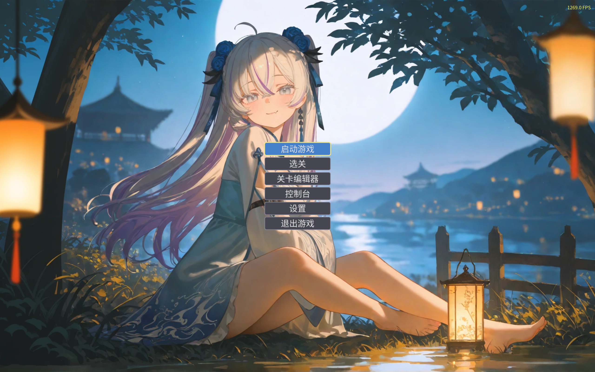
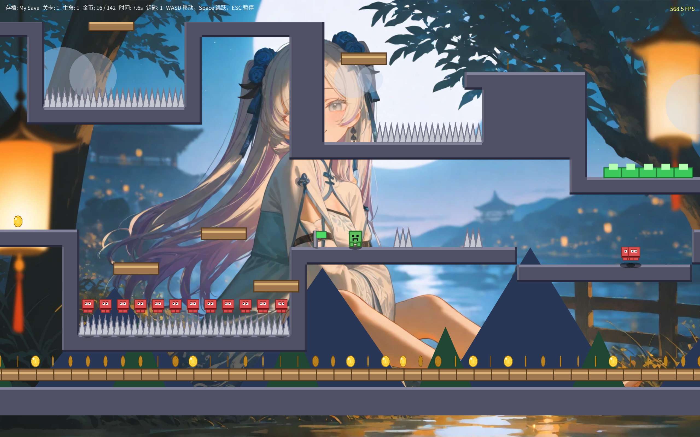
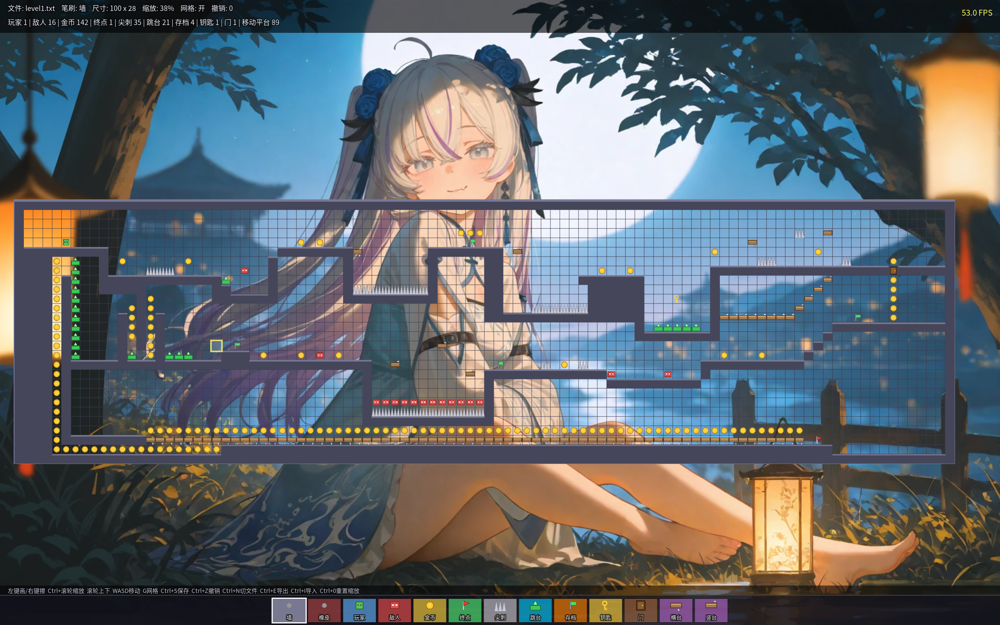
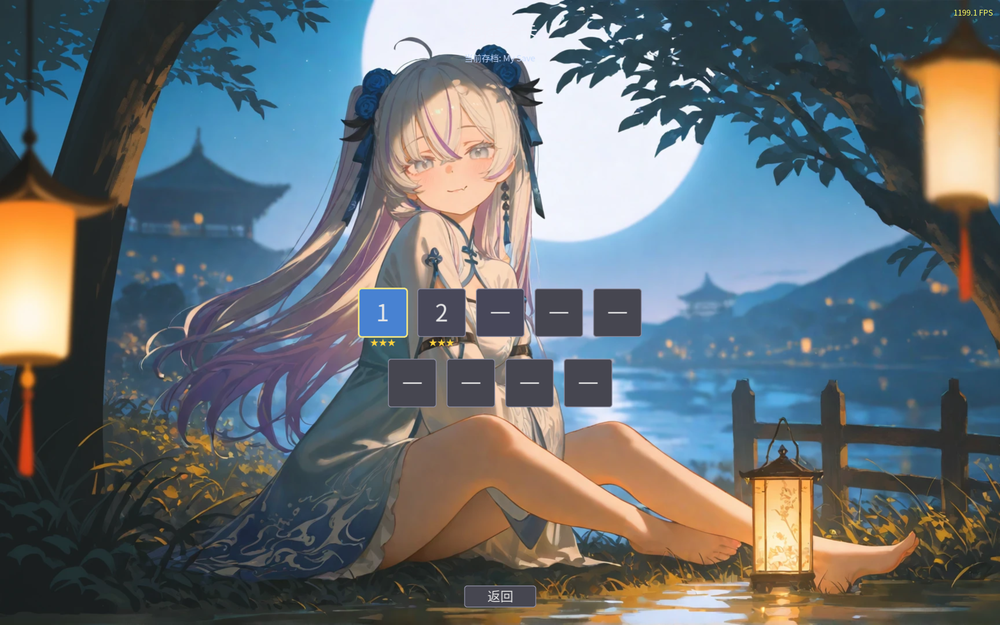

# TEXT-GAME

[](https://github.com/ljm-233/TEXT-GAME/actions/workflows/build.yml)
[](LICENSE)

一个用 **C++20 + SFML 3 从零手写**的 2D 平台跳跃游戏。

不依赖任何游戏引擎——物理、UI、渲染、音频全部自研。项目分 9 个层，从叶子（`utils`）到顶层（`scene`），层间依赖由测试扫描源码树守护，不是靠自觉。

**245 个单元测试用例 / 4776 断言**，在没有 `DISPLAY` 的环境里同样全绿。

---

## 📥 下载

最新版见 [Releases](https://github.com/ljm-233/TEXT-GAME/releases)。

| 产物 | 平台 | 说明 |
| :--- | :--- | :--- |
| `TEXT-GAME-<版本>-x86_64.AppImage` | Linux | **推荐**。自包含，双击即用，不装任何依赖 |
| `TEXT-GAME-<版本>-Linux.tar.gz` | Linux | 解压后运行里面的 `TEXT-GAME`（**自带依赖**，见下） |
| `TEXT-GAME-<版本>-Linux.zip` | Linux | 同上 |
| `TEXT-GAME-<版本>-Linux.deb` | Debian/Ubuntu | 安装后运行 `TEXT-GAME`，同样自带依赖 |
| `TEXT-GAME-<版本>-Linux.rpm` | Fedora/RHEL | 同上 |
| `TEXT-GAME-<版本>-macOS.tar.gz` | macOS | 解压后双击 `text_game.app`（**自带依赖**，见下） |
| `TEXT-GAME-<版本>-Windows.exe` | Windows | NSIS 安装包，**自带 SFML 及其依赖 DLL** |

> **Linux 包自带运行库**：`lib/` 里打包了 SFML 及其依赖（freetype / harfbuzz / X11 / FLAC …），
> 所以**不需要系统预装 SFML 3** —— 这一点很重要，因为 SFML 3 还没进 Debian / Ubuntu 的仓库。
>
> 请运行包里的 **`TEXT-GAME`**（启动脚本）而不是 `text_game`：前者会设置
> `LD_LIBRARY_PATH`，让**间接**依赖也从 `lib/` 解析。直接跑 `text_game` 在没装
> SFML 的机器上会起不来。
>
> GL 驱动相关的库（`libGL` / `libGLX` / `libEGL` …）**刻意没有打包** —— 那些必须用系统那份。
>
> **macOS 包同样自带依赖**，不需要 `brew install sfml`：SFML 及其依赖都在
> `text_game.app/Contents/Frameworks/` 里，install name 已全部改写成包内相对路径，
> 并做了 ad-hoc 重签名（arm64 上没签名内核会直接 SIGKILL）。资源在
> `Contents/Resources/`，所以整个 `.app` 可以随便挪位置。
>
> 包里的可执行文件叫 `text_game`、bundle 目录叫 `text_game.app` ——
> `MACOSX_BUNDLE_BUNDLE_NAME` 只影响 Info.plist 里的显示名，不改目录名。

> **关于 0.3.4 的包体**：Linux 包从 40.5MB 降到 **21.8MB**、AppImage 从 41MB 降到约 **23MB**。
> 做法是把 `wallpaper/` 重新编码（22.9MB → 4.1MB）：最长边压到 3840
> （背景最多也就在 4K 屏上铺满），统一转 JPEG q90。
> 副作用是好的那边：最大那张壁纸解码+上传从 **209ms 降到 74ms**、
> 纹理占用从 **87MB 降到 26MB**。
> 细节与画质实测数据记在 `wallpaper/CREDITS.md` 里，原始文件都在 git 历史中。
>
> `assets/font.ttf`（15.7MB 的完整 Noto Sans CJK）**没有动** —— 子集化能再省 10MB，
> 但代价是玩家名里的生僻字会变豆腐块，所以保留了完整字形。

---

## 🚀 快速开始

```bash
git clone git@github.com:ljm-233/TEXT-GAME.git
cd TEXT-GAME

# 一键启动：增量构建 Release 后直接进游戏（日常就敲这个）
./s.sh
./s.sh --debug          # 要接调试器时
```

首次运行前需要准备字体和依赖，见 [构建与运行](#-构建与运行)。

---

## 🎮 游戏玩法

### 操作

| 键盘 | 手柄 | 功能 |
| :--- | :--- | :--- |
| **A / ←** | 左摇杆 / 十字键左 | 向左移动 |
| **D / →** | 左摇杆 / 十字键右 | 向右移动 |
| **Space / W / ↑** | A 键 / 十字键上 | 跳跃（长按跳更高） |
| **R** | — | 重生（回到最近的存档点） |
| **ESC** | B 键 | 暂停 / 返回 |
| **Enter** | Start 键 | 确认 / 下一关 |

> 以上键位可在 **设置 → 按键** 中自定义。

### 平台跳跃特性

- **土狼时间**：走出平台边缘 0.1 秒内还能跳
- **跳跃缓冲**：落地前 0.12 秒按跳，落地瞬间自动起跳
- **长按跳更高**：松手立刻给上升速度减半
- **固定时间步长物理**：1/120 秒为单位更新，任何 FPS 下手感一致
- **摄像机前瞻**：跑动时镜头朝移动方向偏移，提前露出前方
- **摄像机死区**：小幅移动时镜头不动，减少眩晕
- **受击停顿**：踩敌 / 受伤时，游戏时间冻结几十毫秒
- **手柄振动**：跳跃 / 落地 / 金币 / 踩敌 / 受伤各有不同强度，可在设置里关闭

### 生命与存档

- **初始生命**：在 **设置 → 画面 → 初始生命** 中选择 `1 / 3 / 5 / 10 / 99`
- **存档点**：一个关卡内**最多只有一个激活的存档点**。激活新的会自动取消旧的
- **重生规则**：
  - 掉图 / 被敌人撞 / 踩尖刺后，若还有生命 → 从**最近的存档点**重生
  - 生命耗尽 → **延迟 0.5 秒后**从最近的存档点重生，生命重置
  - 按 `R` 键 → 完全重置关卡（回到出生点、金币归零、存档点取消）
- **没有 Game Over 界面**：生命耗尽后自动重生，不打断游戏流程

### 速通计时（PB）

- 每次通关记录用时
- 关卡完成界面显示：本次用时 / 目标时间 / **历史最佳时间**
- 刷新 PB 时显示金色 `★ 新纪录！`
- 关卡选择页显示每关的 PB

### 星级评定

一关最多 3 星，规则是"**集齐金币** + **时间达标**"两项：

| 条件 | 星级 |
| :--- | :--- |
| 两项都满足 | ★★★ |
| 满足任意一项 | ★★ |
| 都不满足 | ★ |

目标时间 = `30 秒 + 金币数 × 3 秒` —— 金币越多给的时间越长，因为集齐金币本身要多绕路。

### 游戏元素

| 字符 | 元素 | 说明 |
| :--- | :--- | :--- |
| `#` | 地面 / 平台 | 实体瓦片 |
| `P` | 玩家出生点 | 蓝色脉动圆环标记 |
| `E` | 敌人 | 左右巡逻，遇墙或悬崖掉头 |
| `C` | 金币 | 上下浮动，收集计数 |
| `J` | 弹跳板 | 碰到就弹飞，有冷却 |
| `S` | 存档点 | 激活后掉图回到这里（单一激活） |
| `M` | 水平移动平台 | 玩家站上去会被带着走 |
| `V` | 垂直移动平台 | 上下移动 |
| `K` | 钥匙 | 收集后解锁所有门 `L` |
| `L` | 门 | 关着时是实体，解锁后消失 |
| `^` | 尖刺 | 碰到受伤 |
| `G` | 终点 | 红色旗帜，到达通关 |

### 关卡元数据

关卡文件顶部可选加元数据（不占瓦片）：

```
# name: 关卡名
# author: 作者名
########################################
#  ...
```

### 调试快捷键

游戏内按下列快捷键，无需退出即可调试：

| 键 | 功能 |
| :--- | :--- |
| **F1** | 调试 HUD（关卡信息 / 玩家坐标速度 / 鼠标 tile） |
| **F2** | 无敌开关（重生后保留） |
| **F3** | 清空所有敌人 |
| **F4** | 重载当前关卡文件（配合编辑器使用） |
| **F5** | 上一关 |
| **F6** | 下一关 |
| **F7** | 慢动作 1x / 0.5x / 0.25x / 0.1x 循环 |
| **F8** | 显示所有碰撞盒 |
| **F9** | 截图到 `./screenshots/` |
| **F10** | 性能面板（帧时间 / update / render / 上采样耗时） |

---

## 🎨 画面系统

### 渲染管线

```
Scene 绘制 ──> RenderTexture (rt_)
                    │
                    ├─ renderScale < 1.0 ──> [Upscaler: 双三次/FSR1]
                    │
                    ├─ renderScale > 1.0 ──> [超采样降采样]
                    │
                    └─ [PostProcessor: 色彩分级 + 泛光 + 色差 + ...]
                                    │
                                    v
                              window.display()
```

### 超分辨率

`设置 → 界面 → 超分辨率` 三档：

| 模式 | 说明 |
| :--- | :--- |
| **关** | 双线性上采样（最省性能） |
| **双三次** | Catmull-Rom + 轻度锐化 |
| **FSR1** | Lanczos2 EASU（边缘自适应上采样） |

配合 `渲染缩放`（`10%` ~ `200%`）使用：

- **< 100%**：低分辨率渲染 + 超分上采样 → 性能提升
- **= 100%**：直接渲染到窗口
- **> 100%**：超采样渲染 + 降采样 → 抗锯齿

### 后处理

`设置 → 画面` 下方，共 11 个可调项，每项都有滑条、数字输入框、单独重置按钮：

| 效果 | 说明 |
| :--- | :--- |
| **饱和度** | 0% = 灰度，100% = 原色，200% = 过饱和 |
| **对比度** | 50% ~ 200% |
| **亮度** | 50% ~ 200% |
| **伽马** | 50% ~ 250% |
| **暗角** | 屏幕边缘压暗 |
| **泛光强度** | 高亮区域外扩（金币 / 终点 / 跳台） |
| **泛光阈值** | 越低越多物体发光 |
| **色差** | R/B 通道径向偏移（CRT 感） |
| **胶片颗粒** | 每帧微动的随机噪声 |
| **扫描线** | 每隔一行变暗（CRT 感） |
| **抖动** | 4×4 Bayer 矩阵，8-bit 复古质感 |

### 画面预设

`设置 → 画面 → 预设` 一键切换：

| 预设 | 效果 |
| :--- | :--- |
| **原版** | 全部归默认（干净） |
| **复古 CRT** | 色差 + 扫描线 + 暗角 + 颗粒 |
| **电影感** | 泛光 + 暗角 + 高对比 + 轻色差 |
| **像素 8-bit** | 抖动 + 扫描线 + 低强度泛光 |
| **夜晚** | 压暗 + 泛光 + 色差（配合深色主题） |

预设只影响后处理参数，不改动其他画面设置。点预设后可继续手动微调。

---

## 📸 截图

| | |
|:---:|:---:|
|  |  |
| 主菜单 | 游戏中 |
|  |  |
| 关卡编辑器 | 关卡选择 |

---

## 🗺 关卡设计规范

### 玩家能力上限

基于 `game_constants.h` 中的物理常量（重力 2200、跳跃初速 -720、移动速度 300、瓦片 32px），玩家在标准状态下的能力上限：

| 能力 | 数值 | 说明 |
| :--- | :--- | :--- |
| 向上跳跃 | **≤ 3.5 格** | 理论 3.68 格，留 0.18 格容错 |
| 水平跨距 | **≤ 5.5 格** | 理论 6.1 格，留 0.6 格容错 |
| 土狼时间加成 | +0.9 格水平 | 走出边缘后 0.1 秒内仍可跳 |
| 跳跃缓冲加成 | +0.9 格水平 | 落地前 0.12 秒按跳仍生效 |
| 弹跳板 `J` | **≤ 10 格高** | 突破普通跳跃限制，`kLaunchSpeed = -1200` |

### 画关卡时的检查清单

- [ ] 出生点周围 3 格内是平地（玩家不会一出生就掉图）
- [ ] 相邻平台垂直差 ≤ 3 格（保守值）
- [ ] 相邻平台水平差 ≤ 5 格（保守值）
- [ ] 需要跨越的坑宽度 ≤ 5 格
- [ ] 尖刺 `^` 前有至少 3 格反应距离
- [ ] 终点 `G` 站在实体瓦片上（不是悬空）
- [ ] 钥匙 `K` 和门 `L` 之间有绕路，不是直线
- [ ] 存档点 `S` 放在关卡中段，且玩家会自然路过

### 在编辑器里验证

编辑器内按 **T** 打开可达性可视化：

| 颜色 | 含义 |
| :--- | :--- |
| 🟢 淡绿 | 从出生点可达的平台顶面 |
| 🔴 淡红 | 不可达的平台顶面 |
| 🟩 亮绿 | 可达的金币 / 敌人 / 钥匙 / 门 / 存档 / 跳台 / 终点 |
| 🟥 亮红 | 不可达的 spawn |
| 🟦 蓝色 | 玩家出生点 |

一眼就能看出哪块跳不上、哪个金币收不到，不用切场景试玩。

### 命令行验证

```bash
./build/debug/validate_levels assets/levels
```

输出示例：

```
[ OK ] level1.txt: OK (5/5 platforms reachable)
[FAIL] level3.txt: FAIL | goal unreachable | platforms 2/8 reachable
  3 unreachable items:
    - coin @ (42,6)
    - enemy @ (55,8)
    - goal @ (98,4)

合计: 5 个关卡, 1 个失败, 0 个无法加载
```

> 自查一下：当前仓库里 `level1.txt` 与 `editor.txt` 是有不可达元素的，属于待重做的关卡内容。

---

## 🎛 功能一览

### 主菜单

- **启动游戏**：选择 / 创建 / 删除存档
- **选关**：直接跳到已解锁的关卡，显示星级和 PB
- **关卡编辑器**：可视化编辑 ASCII 关卡
- **控制台**：内嵌虚拟终端，支持命令和计算器
- **成就**：跨存档全局，解锁时弹通知
- **设置**：6 个 Tab，70+ 项
- **退出游戏**

### 设置

**显示**：分辨率 / 全屏 / 垂直同步 / 抗锯齿 / 日志级别 / 帧率上限

**界面**：FPS 显示 / 界面缩放 / 字体缩放 / 渲染缩放 / **超分辨率** / 主题 / 语言 / 壁纸 / 时钟 / 控制台遮罩 / 字号 / 历史 / 行高 / 自动滚动 / 光标闪烁 / 提示符

**画面**：初始生命 / 动画 / 伪3D / 视差 / 玩家动画 / 关卡开场 / 粒子 / 屏幕震动 / 通知 / 按钮圆角 / 按钮边框 / 显示碰撞盒 / **画面预设** / **11 项后处理**

**音频**：总音量 / 音效开关 / 音效音量 / BGM 开关 / BGM 音量 / 手柄支持 / **手柄振动** / **振动强度**

**按键**：左移 / 右移 / 跳跃 / 暂停 / 重开（可重映射）

**其他**：记住窗口大小 / 失焦自动暂停 / 日志轮转 / 保留份数 / 玩家名 / 关于 / 恢复默认

> **所有可拖动的滑块**都带数字输入框（回车确认）+ 单滑块重置按钮（↺）。画面 Tab 底部还有一个"重置画面"按钮，一键归零所有后处理。

### 关卡编辑器

- 底部笔刷面板（13 种元素，图标预览）
- **左键画 / 拖动连画**（斜线也支持）
- **Shift + 拖动 = 矩形填充**（带黄色预览）
- **右键擦 / 拖动连擦**
- **T 键**：可达性可视化开关
- `Ctrl+Z` 撤销（100 步栈）
- `Ctrl+S` 保存
- `Ctrl+N` 切换文件
- `Ctrl+E` 导出分享码
- `Ctrl+I` 导入分享码
- `Ctrl+0` 重置缩放
- `Ctrl+滚轮` 缩放（以鼠标为中心）
- `WASD` / 方向键移动摄像机
- `[` `]` `-` `=` 调整关卡尺寸
- `G` 开关网格
- 顶部 HUD：文件名 / 笔刷 / 尺寸 / 缩放 / 网格 / 撤销栈深度 / 可达性状态
- 第二行：元素统计（玩家 / 敌人 / 金币 / ...）
- **性能优化**：笔刷条和关卡图标预渲染到 `RenderTexture`，静止时每帧仅 3 个 draw call

**分享码**：把当前关卡编码成 `TG1:<base64(RLE(关卡文本))>` 字符串，导出到 `saves/share_code.txt`。别人粘贴到你自己的 `share_code.txt`，`Ctrl+I` 即可导入。

### 控制台命令

```
help              显示帮助
clear             清空屏幕
echo <text>       回显文本
version           显示版本
calc              启动计算器
scene <name>      切换场景 (main/save/settings/quit)
log <level>       设置日志级别
theme <name>      切换主题 (dark/blue/light)
save list         列出所有存档
exit              关闭控制台
```

---

## 🌏 多语言

支持 5 种语言，运行时在 **设置 → 界面 → 语言** 中切换：

| 语言 | 文件 |
| :--- | :--- |
| 中文 | 隐含（key 即中文原文） |
| 繁體中文 | `assets/lang/zh-TW.txt` |
| English | `assets/lang/en.txt` |
| 日本語 | `assets/lang/ja.txt` |
| 한국어 | `assets/lang/ko.txt` |

### 添加新语言

1. 复制 `assets/lang/en.txt` 为 `assets/lang/xx.txt`（xx 是语言代码）
2. 逐行翻译（key 是中文原文，一字不差）
3. 在设置场景的语言按钮处加显示名
4. 重新编译，运行

---

## 📁 项目结构

```text
TEXT-GAME/
├── include/                  # 与 src/ 一一对应，共 9 层（从叶子到顶层）
│   ├── utils/                # 零内部依赖的叶子
│   │   ├── utf8.h            # std::string ↔ sf::String（中文必须走 toSf）
│   │   ├── vec2.h            # 二维向量
│   │   ├── animation.h       # 缓动函数 + 全局动画开关
│   │   ├── animator.h        # 精灵帧动画
│   │   ├── lang.h            # 多语言加载
│   │   └── text_strings.h    # 所有用户可见字符串
│   ├── common/               # 共享基元（AppError / ContainerError）
│   ├── infrastructure/       # 设备层
│   │   ├── gamepad.h         # 手柄 + 焦点导航
│   │   ├── gamepad_vibration.h
│   │   └── keybindings.h     # 运行时键位重映射
│   ├── config/               # key=value 存储 + keys.h（配置键唯一来源）
│   ├── log/                  # 日志三层：Logger / Formatter / Handler
│   ├── core/                 # 应用骨架
│   │   ├── container.h       # 命名式 DI 容器
│   │   ├── application.h     # 五阶段生命周期 + 四类钩子
│   │   ├── main_loop.h       # MainLoop 抽象 + Headless 兜底
│   │   ├── scene_registry.h  # SceneId → 工厂
│   │   ├── scene_manager.h   # 场景常驻缓存
│   │   ├── bootstrap.h       # registerCore() / wireCore()
│   │   ├── game.h            # 游戏主循环（MainLoop 的实现）
│   │   ├── paths.h           # 资源目录（支持测试沙箱）
│   │   └── achievement.h
│   ├── ui/                   # UI 组件与渲染（Window / Upscaler / PostProcessor /
│   │                         #   ParticleSystem / Button / Slider / Theme / ...）
│   ├── game/                 # 游戏本体
│   │   ├── game_world.h      # 世界：物理 + 碰撞 + 发事件
│   │   ├── level.h           # ASCII 关卡
│   │   ├── level_validator.h # 关卡可达性验证
│   │   ├── level_codec.h     # 分享码（RLE + Base64）
│   │   ├── score_rules.h     # 星级 / 目标时间 / PB 规则
│   │   ├── save_manager.h    # 存档读写
│   │   ├── player.h / enemy.h / coin.h / checkpoint.h / door.h / spike.h ...
│   ├── scene/                # 8 个场景 + 设置 Tab + 编辑器工具
│   │   ├── main_menu_scene.h / save_select_scene.h / level_select_scene.h
│   │   ├── game_scene.h / settings_scene.h / console_scene.h
│   │   ├── editor_scene.h / achievement_scene.h
│   │   ├── editor_tools.h    # 编辑器格子几何（纯函数，可测）
│   │   ├── console/          # 控制台命令（计算器等）
│   │   └── tabs/             # 6 个设置 Tab
│   └── ...
├── src/                      # 对应 include 的实现
├── tests/                    # doctest 单元测试（含分层架构测试）
├── tools/validate_levels.cpp # 关卡验证器（命令行）
├── assets/
│   ├── levels/*.txt          # ASCII 关卡
│   ├── shaders/*.frag        # GLSL 着色器（5 个）
│   ├── lang/*.txt            # 翻译文件
│   └── font.ttf              # 字体（名字固定，见下文）
├── packaging/                # 图标生成 / AppImage / Windows 资源
├── scripts/                  # 硬编码检测 / 测试 / 桌面集成 / 关卡生成
├── docs/screenshots/         # README 用的截图
├── s.sh                      # 一键构建 + 启动游戏
├── dump.sh                   # 生成源码快照（喂给 AI 用）
├── CMakeLists.txt / CMakePresets.json
└── CLAUDE.md                 # 给 AI 助手的项目说明
```

---

## 🧩 架构

### 分层

```
  scene                 ← 具体场景
    ↑
  ui    game            ← 兄弟层，双向都不许依赖
    ↑
  core                  ← Container / Application / 场景契约
    ↑
  config   log
    ↑
  common  infrastructure  utils   ← 叶子层
```

**分层规则由测试守护，不是靠自觉**：`tests/test_layers.cpp` 会扫描全部 `include/` 与 `src/`，把 `#include` 解析成"哪一层指向哪一层"并比对禁止表。违规会让 `ctest` 直接失败并报出 `文件:行号`。

- `ui` 与 `game` **双向**都不许互相 include。`GameWorld` 通过 `EventBus` 发事件，`GameScene` 订阅后处理音效 / 粒子 / 振动；粒子系统归 `GameScene` 所有
- `utils` / `common` 是零内部依赖的叶子
- `infrastructure` 是设备层，不认识应用层与前端
- **跨层 include 用限定路径**（`utils/utf8.h`）。`include/utils` 与 `include/infrastructure` 刻意不在 include 路径里，平铺写法根本编译不过，跨层依赖在 include 行上直接可见

### 装配与生命周期

`main()` 只做三件事：装配、跑生命周期、交退出码。

```cpp
app.boot([](Application& a) {
    registerConfig(a.container());  // 各层自带 bootstrap，底层在前
    registerLog(a.container());
    registerCore(a.container());
    registerScenes(a.container());
    wireCore(a);                    // 挂钩子，此处不执行
});
code = app.exec();
```

- **`Container`**：命名式注册表，`reg` / `get` / `require` / `tryGet` / `peek` / `touch`。只管注册与解析，**不认识生命周期**
- **`Application::exec()` 五阶段**：boot → setup → wire → run → teardown，teardown 用 RAII 守卫保证必达
- **四类钩子**：`onBoot` / `onLoop` / `onQuit` / `onFinal`，先注册先执行
- **`MainLoop`**：前端交出主循环的入口；没有前端时自动回退 `HeadlessMainLoop`
- **boot 阶段必须无副作用**（只放工厂）。偏好生效、子系统初始化都在 `wireCore` 挂的 `onBoot` 钩子里做

### 引擎层

| 模块 | 职责 |
| :--- | :--- |
| **DI 容器** | 命名式注册表，只管注册与解析 |
| **事件总线** | `GameWorld` 发游戏事件，`GameScene` 订阅处理音效 / 粒子 / 振动 |
| **场景系统** | 8 个场景；支持场景栈返回（保留状态）；钩子 `onEnter/onExit/onPause/onResume` |
| **配置分层** | Bootstrap / Runtime / Preferences，延迟落盘 |
| **日志** | 门面 / 格式化 / 落点三层，彩色终端 + 文件 + 轮转 + 保留份数 |
| **多语言** | 用中文原文作 key，运行时查表 |
| **UI 组件** | Button / Slider / TextInput / ConfirmDialog / PauseMenu |
| **手柄** | 焦点导航 + 振动（Linux evdev / Windows XInput / 其它平台空实现） |
| **通知** | 屏幕角落消息，4 类型 × 4 位置 |
| **音效** | 程序化生成（正弦扫频 + 琶音 + 敲击），零外部依赖 |
| **打包** | CPack / AppImage / NSIS |

### 游戏层

| 模块 | 说明 |
| :--- | :--- |
| **物理** | 自写 AABB 瓦片扫描，先水平后垂直，固定步长 1/120 |
| **关卡** | ASCII 加载 + 视锥裁剪 + 顶点批处理 |
| **关卡验证** | BFS 从出生点出发，报告孤立平台 / 不可达元素 |
| **关卡分享码** | RLE + Base64 |
| **星级 / PB** | 集齐金币 + 时间达标 → 1~3 星；每关记录最佳时间 |
| **伪 3D** | 瓦片顶面高光 + 侧面阴影 + 对象投影 + 软阴影 |
| **摄像机** | 前瞻 + 死区 + 屏幕震动 + 受击停顿 |
| **调试工具** | F1~F10 快捷键 + 性能面板 + 截图 + 慢动作 + 碰撞盒 |

---

## 🛠 技术栈

- **语言**：C++20
- **构建**：CMake ≥ 3.23 + Ninja + CMake Presets
- **图形 / 音频**：SFML 3
- **OpenGL**：截图用 `glReadPixels`
- **物理**：自写 AABB（不依赖 Box2D）
- **着色器**：GLSL 330 core（超分 + 后处理）
- **测试**：doctest（单头文件，245 个用例 / 4776 断言，**无 DISPLAY 也能全绿**）
- **静态分析**：clang-tidy（`.clang-tidy` + CI 门禁，`WarningsAsErrors`）
- **内存检测**：AddressSanitizer + UndefinedBehaviorSanitizer（CI 里有独立 job）
- **覆盖率**：gcov + lcov
- **打包**：CPack / AppImage / NSIS，五种 Linux 包 + macOS `.app` + Windows 安装包
- **CI**：GitHub Actions，6 个 job 全绿 ——
  Arch / Ubuntu 24.04 / macOS / Windows 四个平台构建 + 单测，
  外加 **Sanitizer**（ASan+UBSan+LSan）与 **clang-tidy** 两个质量门
- **跨平台**：Linux / Windows / macOS

---

## 🔨 构建与运行

### 环境要求

**Arch Linux**：
```bash
sudo pacman -S base-devel cmake ninja sfml python-fonttools python-pillow lcov clang mesa
```

**Ubuntu / Debian**：
```bash
sudo apt install build-essential cmake ninja-build libsfml-dev lcov clang-tidy libgl1-mesa-dev
```
> ⚠️ Ubuntu 24.04 的 `libsfml-dev` 可能是 SFML 2.6。需要从源码编译 SFML 3，见 CI 配置。

**macOS**：
```bash
brew install cmake ninja sfml lcov
```

**Windows**：Visual Studio 2022 + vcpkg
```powershell
vcpkg install sfml:x64-windows
```

### 准备字体

项目需要中文字体文件 `assets/font.ttf`（代码里写死的就是这个文件名，
见 `src/core/bootstrap.cpp`）：

```bash
python3 -c "
from fontTools.ttLib import TTCollection
ttc = TTCollection('/usr/share/fonts/noto-cjk/NotoSansCJK-Regular.ttc')
ttc.fonts[2].save('assets/font.ttf')
"
```

或者从 [Google Fonts](https://fonts.google.com/noto/specimen/Noto+Sans+SC) 下载一份
Noto Sans SC，**重命名为 `font.ttf`**（哪怕拿到的是 `.otf`，文件名也必须是 `.ttf`）。

### 编译运行

```bash
cmake --list-presets

# Debug 构建
cmake --preset debug
cmake --build --preset debug
./build/debug/text_game

# Release 构建（**推荐跑游戏用这个**）
cmake --preset release
cmake --build --preset release
./build/release/text_game
```

**可用的 Preset**：

| Preset | 用途 |
| :--- | :--- |
| `debug` | 标准 Debug 构建 |
| `release` | 发布构建 |
| `tests` | Debug + 单元测试 |
| `asan` | Debug + 测试 + Sanitizer |
| `coverage` | Debug + 测试 + 覆盖率 |
| `clang-tidy` | Debug + 静态分析 |
| `release-package` | 用于 cpack 的发布构建 |
| `vcpkg-*` | Windows / vcpkg 变体 |

> ⚠️ Debug 构建下 SFML 的 `sf::Text` 和 `sf::Shape` 构造极慢，编辑器帧率可能只有 20~30fps。**跑游戏和编辑器请用 Release**。

### 打包发布

**Linux AppImage**（自包含，推荐）：

```bash
python3 packaging/icons/generate_icons.py
cmake --preset release-package
cmake --build --preset release-package -j
./packaging/build_appimage.sh
# 版本号取自 CMakeLists.txt 的 project(... VERSION ...)
./build/TEXT-GAME-<版本>-x86_64.AppImage
```

**通用 CPack**：

```bash
cmake --preset release-package     # 这个 preset 已开 BUNDLE_RUNTIME_DEPS=ON
cmake --build --preset release-package
cd build/release-package
cpack                                   # 默认 TGZ + ZIP
cpack -G "DEB;RPM"                      # 需要 dpkg-deb / rpmbuild
```

> `BUNDLE_RUNTIME_DEPS=ON` 会用 CMake 的 `GET_RUNTIME_DEPENDENCIES` 收集运行库塞进 `lib/`，
> 并额外装一个 `TEXT-GAME` 启动器。单独 `cmake --preset release` 打出来的包则不带这些。

**Windows NSIS 安装包**：

```powershell
cmake --preset release
cmake --build --preset release -j
cd build/release
cpack -G NSIS
```

> 打 tag（形如 `v1.2.3`）会触发 `.github/workflows/release.yml`，在 CI 上建 Release。
> **三个平台一次出全**：
>
> | 平台 | 产物 |
> | :--- | :--- |
> | Linux | `tar.gz` / `zip` / `deb` / `rpm` / `AppImage` |
> | macOS | `tar.gz`（自带依赖的 `.app`） |
> | Windows | `.exe`（NSIS 安装包，自带 SFML DLL） |
>
> 每个 job 都带**自检步骤，不达标就红** —— 不达标的包不会发出去：
> Linux 查 `lib/` 库数量、`ldd` 有没有 `not found`、deb 的架构字段、
> rpm 的 ARCH、AppImage 解包后能不能解析全部依赖；macOS 查 `.app` 数量、
> 资源位置、每个 Mach-O 的代码签名、有没有残留的绝对依赖路径；
> Windows 查安装包里有没有 `sfml-*.dll` 和 `font.ttf`。

> 想在不发版的情况下验证打包：`gh workflow run release.yml`。
> `create-release` 有 `if: startsWith(github.ref, 'refs/tags/')`，
> 手动触发只当打包演练用，不会创建 release，跑完能从 artifacts 里下载包。

### 单元测试

```bash
cmake --preset tests
cmake --build --preset tests
ctest --preset tests
# 或直接跑：./build/tests/tests/unit_tests
```

### 内存检测

```bash
cmake --preset asan
cmake --build --preset asan
./build/asan/tests/unit_tests
./build/asan/text_game
```

### 代码覆盖率

```bash
cmake --preset coverage
cmake --build --preset coverage
cmake --build --preset coverage --target coverage
# 报告生成在 build/coverage/coverage_html/index.html
```

### 静态分析

```bash
# 方式一：构建时跑（慢，适合边写边看）
cmake --preset clang-tidy
cmake --build --preset clang-tidy -j

# 方式二：只 configure，再并行跑一遍（CI 用的就是这个，快得多）
cmake -S . -B build/lint -G Ninja -DCMAKE_BUILD_TYPE=Release \
      -DCMAKE_EXPORT_COMPILE_COMMANDS=ON
run-clang-tidy -p build/lint -j "$(nproc)" src/
```

检查项写在仓库根的 `.clang-tidy` 里，原则是**只开能当 BUG 修的检查**，
并设了 `WarningsAsErrors: '*'` —— 有任何一条就是非零退出码，CI 会红。

带一堆假阳性的门禁会被无视，所以 `easily-swappable-parameters`、
`signed-bitwise`（UTF-8 编码里的位运算）、`narrowing-conversions`、
`clang-analyzer-optin.*` 这些都排除了。**往里加检查之前，先确认当前代码能过。**

### 格式化

`.clang-format` 在仓库根。`format.yml` **只检查 PR 改动过的文件**：

```bash
# 手工整理你动过的文件
clang-format -i src/foo.cpp include/foo.h
```

> 仓库里还有 132 / 193 个源文件不符合 `.clang-format`（历史遗留）。
> 一次性清掉的话：`clang-format -i $(find src include -name '*.cpp' -o -name '*.h')`
> —— 约 7340 行纯机械改动，建议单独占一个 commit。

### 检查硬编码中文

```bash
python3 scripts/check_hardcoded.py
```

---

## 🚧 已知问题与路线

### 已知问题

- **场景与 UI 组件本身没有单元测试** —— 它们的构造需要 `sf::Font`，而那是
  `GlResource`，没有 GL 上下文连构造都做不到。其中的纯逻辑（星级规则、编辑器
  格子几何、手柄焦点导航）已经抽成独立模块测过了。
- Wayland 下窗口图标无法通过 SFML API 设置（协议限制）。
- **macOS 的包没有在真 Mac 上启动过** —— CI 只做了静态校验（`.app` 数量、
  资源位置、每个 Mach-O 的 `codesign --verify`、没有残留的绝对依赖路径），
  Windows 的 NSIS 安装包同理（只验了安装树里有 SFML 的 DLL 和字体）。
  手上有这几台机器的话麻烦实际跑一下。
- **还有 132 / 193 个源文件不符合 `.clang-format`**。`format.yml` 只检查 PR
  改动过的文件，所以新代码是干净的；一次性的全量整理见 README 的「格式化」一节。
- **关卡内容待重做**：`level1.txt` 与 `editor.txt` 目前存在不可达元素，
  可以用 `validate_levels` 或编辑器里按 T 看到。

### 短期路线

1. 依次重做 `level2` ~ `level5`

> 更细的开发说明（分层规则、装配与生命周期、已知陷阱）见
> [CLAUDE.md](CLAUDE.md)。

---

## 🧭 开发约定

1. **新增 `src/` 一级子目录时，要在 `CMakeLists.txt` 的 GLOB 列表里加一行**（`.cpp` 文件本身会被自动扫描）。
2. **头文件用 `#pragma once`，`.cpp` 首行必须是 `#include`**。
3. **每层自带一个 bootstrap**（`registerXxx(Container&)`），入口只负责按"底层在前"的顺序调用它们。
4. **中文要经过 `toSf()` 转换**（`include/utils/utf8.h`），否则 SFML 3 会按 Latin-1 解释。
5. **字号用 `scaledFontSize()`**，跟随全局 UI 缩放。
6. **颜色从 `getTheme()` 取**，不要硬编码。
7. **配置读写走 `Config::set*` / `get*`**，写盘由 `flush()` 统一处理。
   **配置键用 `include/config/keys.h` 的常量**，不要写字面量 —— 写错字只会静默回退默认值。
8. **物理常量放 `include/game/game_constants.h`**。
9. **每帧渲染用 `screenView`**，不用 `getDefaultView()`。
10. **手柄焦点导航在状态变化时注册**（`onEnter` / `onResume` / `update` / `syncFocus()`），
    **不要放在 `render()` 里** —— 渲染函数不该有副作用。
11. **UI 文字走 `Str::T(Str::Xxx)`**，字符串定义在 `include/utils/text_strings.h`。
12. **游戏事件走 EventBus**，不要从 `GameWorld` 直接调 SoundManager / ParticleSystem / Gamepad。
13. **着色器放 `assets/shaders/`**，`.frag` 后缀，GLSL 330 core。
14. **跨层 include 用限定路径**（`utils/utf8.h`、`infrastructure/gamepad.h`）。
15. **发行版的默认设置改 `assets/defaults/preferences.conf`**。它只在用户**没有**配置文件时
    铺一次（`config/bootstrap.cpp`），之后永远归用户所有。**不要把个人或机器相关的键放进去**
    （玩家名 / 分辨率 / 全屏 / UI 缩放 / 壁纸 / 键位）——那会让每个新用户都继承开发机的状态。

### 代码格式化

```bash
find src include -name "*.cpp" -o -name "*.h" | xargs clang-format -i
```

---

## 📜 License

[MIT](LICENSE)
